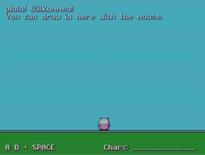

# TIGR - TIny GRaphics library


TIGR is a tiny cross-platform graphics library,
providing a unified API for Windows, macOS, Linux, iOS and Android.

TIGR's core is a simple framebuffer library.
On top of that, we provide a few helpers for the common tasks that 2D programs generally need:

 - Bitmap-backed windows.
 - Direct access to bitmaps, no locking.
 - Basic drawing helpers (plot, line, blitter).
 - Text output using bitmap fonts.
 - Mouse, touch and keyboard input.
 - PNG loading and saving.
 - Easy pixel shader access.

TIGR is designed to be small and independent.
The 'hello world' example is less than 100kB:

| *Platform* | *Size* |
| --- | --- |
| windows x86_64 | 48k |
| linux x86_64 | 43k |
| macOS arm64 | 90k |
| macOS x86_64 | 74k |

There are no additional libraries to include; everything is baked right into your program.

TIGR is free to copy with no restrictions; see [tigr.h](tigr.h).

<br>


## Installation

Run:

```bash
$ npm i tigr.c
```

And then include `tigr.h` as follows:

```c
// main.c
#define TIGR_IMPLEMENTATION
#include <tigr.h>

int main() { /* ... */ }
```

Finally, compile while adding the path `node_modules/tigr.c` to your compiler's include paths.

```bash
$ clang -I./node_modules/tigr.c main.c  # or, use gcc
$ gcc   -I./node_modules/tigr.c main.c
```

You may also use a simpler approach with the [cpoach](https://www.npmjs.com/package/cpoach.sh) tool, which automatically adds the necessary include paths of all the installed dependencies for your project.

```bash
$ cpoach clang main.c  # or, use gcc
$ cpoach gcc   main.c
```

<br>


## How do I program with TIGR?


Here's an example Hello World program. For more information, just read [tigr.h](tigr.h) to see the APIs available.

```c
#include "tigr.h"

int main(int argc, char *argv[]) {
  Tigr *screen = tigrWindow(320, 240, "Hello", 0);
  while (!tigrClosed(screen)) {
    tigrClear(screen, tigrRGB(0x80, 0x90, 0xa0));
    tigrPrint(screen, tfont, 120, 110, tigrRGB(0xff, 0xff, 0xff), "Hello, world.");
    tigrUpdate(screen);
  }
  tigrFree(screen);
  return 0;
}
```

<br>


## How to set up TIGR

### Desktop (Windows, macOS, Linux)

To use it, you just include them into your project.

1. Define `TIGR_IMPLEMENTATION` in **one** source file before including `tigr.h`.
2. Link with
    - -lopengl32 and -lgdi32 on Windows
    - -framework OpenGL and -framework Cocoa on macOS
    - -lGLU -lGL -lX11 on Linux
3. You're done!

### Android

Due to the complex lifecycle and packaging of Android apps
(there is no such thing as a single source file Android app),
a tiny wrapper around TIGR is needed. Still - the TIGR API stays the same!

To keep TIGR as tiny and focused as it is, the Android wrapper lives in a separate repo.

To get started on Android, head over to the [TIMOGR](https://github.com/erkkah/timogr) repo and continue there.

### iOS

On iOS, TIGR is implemented as an app delegate, which can be used in your app with just a few lines of code.

Building an iOS app usually requires quite a bit of tinkering in Xcode just to get up and running. To get up and running **fast**, there is an iOS starter project with a completely commandline-based tool chain, and VS Code configurations for debugging.

To get started on iOS, head over to the [TIMOGRiOS](https://github.com/erkkah/timogrios) repo and continue there.

> NOTE: TIGR is included in TIMOGR and TIMOGRiOS, there is no need to install TIGR separately.

<br>


## Fonts and shaders

### Custom fonts

TIGR comes with a built-in bitmap font, accessed by the `tfont` variable. Custom fonts can be loaded from bitmaps using `tigrLoadFont`. A font bitmap contains rows of characters separated by same-colored borders. TIGR assumes that the borders use the same color as the top-left pixel in the bitmap. Each character is assumed to be drawn in white on a transparent background to make tinting work.

Use the [tigrfont](https://github.com/erkkah/tigrfont) tool to create your own bitmap fonts from TTF or BDF font files.

Since TIGR version 3.1, unicode-encoded font sheets are supported, making it possible to render any glyph in your fonts. Text is still just rendered LTR, though.

### Custom pixel shaders

TIGR uses a built-in pixel shader that provides a couple of stock effects as controlled by `tigrSetPostFX`.
These stock effects can be replaced by calling `tigrSetPostShader` with a custom shader.
The custom shader is in the form of a shader function: `void fxShader(out vec4 color, in vec2 uv)` and has access to the four parameters from `tigrSetPostFX` as a `uniform vec4` called `parameters`.

See the [shader example](https://github.com/erkkah/tigr/blob/master/examples/shader/shader.c) for more details.

<br>


## Known issues

On macOS, seemingly depending on SDK version and if you use TIGR in an Xcode project, you need to define `OBJC_OLD_DISPATCH_PROTOTYPES` to avoid problems with `objc_msgSend` prototypes.

<br>
<br>


[](https://wolfram77.github.io)<br>
[](https://github.com/erkkah/tigr)
[](https://nodef.github.io)

